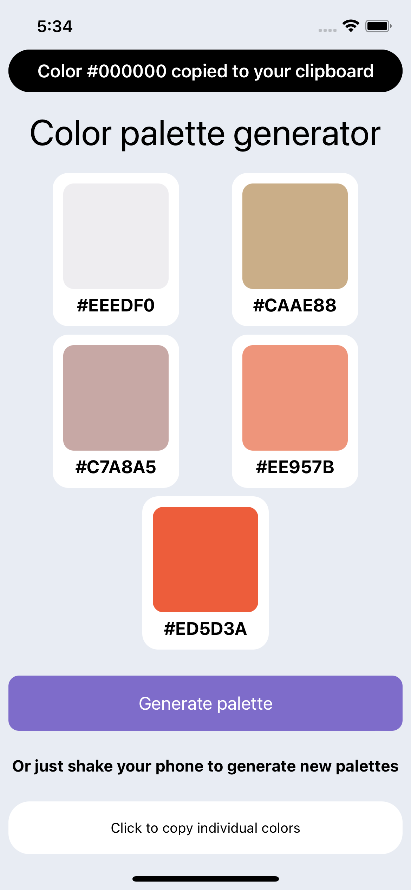

# DevProjects - Random color palette generator mobile app

This is an open source project from [DevProjects](http://www.codementor.io/projects). Feedback and questions are welcome!
Find the project requirements here: [Random color palette generator mobile app](https://www.codementor.io/projects/mobile/random-color-palette-generator-mobile-app-cfkyclpsex)

## Tech/framework used
Built with Swift, SwiftUI

## Screenshots and demo

## Installation
Open and run with Xcode

## License
[MIT](https://choosealicense.com/licenses/mit/)
Most open source projects use the MIT license. Feel free to choose whichever license you prefer.

